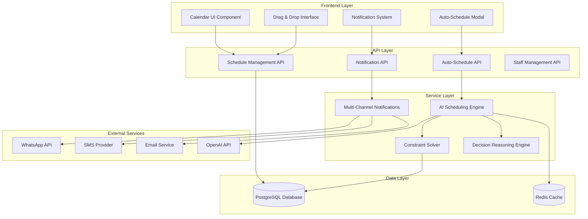

# Auto-Schedule System Design Document

## Overview

The Auto-Schedule System is a comprehensive restaurant staff scheduling solution that combines an intuitive drag-and-drop calendar interface with AI-powered automatic scheduling capabilities. The system leverages the existing FastAPI backend with SQLAlchemy models and a Next.js frontend with React components to deliver a seamless scheduling experience.

The system architecture follows a microservices approach with clear separation between the frontend presentation layer, backend API services, and AI scheduling engine. The design emphasizes real-time updates, transparent decision-making, and flexible manual override capabilities.

## Architecture

### High-Level Architecture



### Technology Stack

- **Frontend**: Next.js 15, React 18, TypeScript, Tailwind CSS
- **Backend**: FastAPI, SQLAlchemy, Python 3.9+
- **Database**: PostgreSQL (via Supabase)
- **Caching**: Redis
- **AI/ML**: OpenAI GPT-4, Custom constraint solving algorithms
- **Real-time**: WebSocket connections for live updates
- **Notifications**: WhatsApp Business API, SMS providers, Email services

## Components and Interfaces

### Frontend Components

#### 1. ScheduleCalendarView Component

```typescript
interface ScheduleCalendarViewProps {
  businessId: number;
  weekStart: Date;
  onWeekChange: (date: Date) => void;
  onShiftEdit: (shift: Shift) => void;
  onAutoSchedule: () => void;
}

interface CalendarShift {
  id: number;
  title: string;
  startTime: string;
  endTime: string;
  date: Date;
  requiredSkill: string;
  assignments: ShiftAssignment[];
  status: 'open' | 'filled' | 'understaffed';
  confidenceScore?: number;
  reasoning?: string;
}
```

#### 2. AutoScheduleModal Component

```typescript
interface AutoScheduleModalProps {
  isOpen: boolean;
  onClose: () => void;
  onConfirm: (params: AutoScheduleParams) => void;
  businessId: number;
}

interface AutoScheduleParams {
  dateRange: {
    start: Date;
    end: Date;
  };
  specialEvents: SpecialEvent[];
  staffNotes: StaffNote[];
  constraints: SchedulingConstraints;
}

interface SpecialEvent {
  date: Date;
  name: string;
  expectedImpact: 'low' | 'medium' | 'high';
  description?: string;
}
```

#### 3. ShiftDragDropInterface Component

```typescript
interface DragDropShiftProps {
  shift: CalendarShift;
  availableStaff: Staff[];
  onStaffAssign: (shiftId: number, staffId: number) => void;
  onStaffUnassign: (assignmentId: number) => void;
  onShiftModify: (shiftId: number, changes: Partial<Shift>) => void;
}
```

### Backend API Endpoints

#### 1. Auto-Schedule API

```python
@app.post("/api/auto-schedule/{business_id}/generate")
async def generate_auto_schedule(
    business_id: int,
    params: AutoScheduleRequest,
    db: Session = Depends(get_db)
) -> AutoScheduleResponse:
    """Generate AI-powered schedule for specified date range"""

@app.get("/api/auto-schedule/{business_id}/draft/{draft_id}")
async def get_schedule_draft(
    business_id: int,
    draft_id: str,
    db: Session = Depends(get_db)
) -> ScheduleDraft:
    """Retrieve draft schedule for review"""

@app.put("/api/auto-schedule/{business_id}/draft/{draft_id}")
async def update_schedule_draft(
    business_id: int,
    draft_id: str,
    changes: List[ScheduleChange],
    db: Session = Depends(get_db)
) -> ScheduleDraft:
    """Update draft schedule with manual changes"""

@app.post("/api/auto-schedule/{business_id}/publish/{draft_id}")
async def publish_schedule(
    business_id: int,
    draft_id: str,
    notification_settings: NotificationSettings,
    db: Session = Depends(get_db)
) -> PublishResponse:
    """Publish final schedule and send notifications"""
```

#### 2. Schedule Management API

```python
@app.get("/api/schedule/{business_id}/calendar")
async def get_calendar_view(
    business_id: int,
    start_date: date,
    end_date: date,
    db: Session = Depends(get_db)
) -> CalendarView:
    """Get calendar view with shifts and assignments"""

@app.post("/api/schedule/{business_id}/shifts")
async def create_shift(
    business_id: int,
    shift: ShiftCreate,
    db: Session = Depends(get_db)
) -> Shift:
    """Create new shift"""

@app.put("/api/schedule/shifts/{shift_id}/assign")
async def assign_staff_to_shift(
    shift_id: int,
    assignment: StaffAssignment,
    db: Session = Depends(get_db)
) -> ShiftAssignment:
    """Assign staff member to shift"""
```

### Service Layer Components

#### 1. AI Scheduling Engine

```python
class AISchedulingEngine:
    def __init__(self, db: Session, openai_client: OpenAI):
        self.db = db
        self.openai_client = openai_client
        self.constraint_solver = ConstraintSolver(db)
        self.reasoning_engine = ReasoningEngine()
    
    async def generate_schedule(
        self,
        business_id: int,
        date_range: DateRange,
        constraints: SchedulingConstraints,
        special_events: List[SpecialEvent]
    ) -> ScheduleDraft:
        """Generate optimal schedule using AI and constraint solving"""
    
    async def explain_assignment(
        self,
        assignment: ShiftAssignment,
        context: SchedulingContext
    ) -> AssignmentReasoning:
        """Generate human-readable explanation for assignment decision"""
```

#### 2. Constraint Solver

```python
class ConstraintSolver:
    def __init__(self, db: Session):
        self.db = db
    
    def solve_scheduling_constraints(
        self,
        shifts: List[Shift],
        staff: List[Staff],
        constraints: SchedulingConstraints
    ) -> List[ShiftAssignment]:
        """Solve scheduling optimization problem with constraints"""
    
    def validate_assignment(
        self,
        shift: Shift,
        staff_member: Staff,
        existing_assignments: List[ShiftAssignment]
    ) -> ValidationResult:
        """Validate if staff assignment meets all constraints"""
```

#### 3. Multi-Channel Notification Service

```python
class NotificationService:
    def __init__(self):
        self.whatsapp_service = WhatsAppService()
        self.sms_service = SMSService()
        self.email_service = EmailService()
    
    async def send_schedule_notifications(
        self,
        schedule: PublishedSchedule,
        notification_settings: NotificationSettings
    ) -> NotificationResults:
        """Send schedule notifications via multiple channels"""
    
    async def send_change_summary(
        self,
        staff_member: Staff,
        changes: List[ScheduleChange],
        preferred_channel: str
    ) -> NotificationResult:
        """Send personalized change summary to staff member"""
```

## Data Models

### Core Scheduling Models

```python
class ScheduleDraft(Base):
    __tablename__ = "schedule_drafts"
    
    id = Column(String, primary_key=True, default=lambda: str(uuid.uuid4()))
    business_id = Column(Integer, ForeignKey("businesses.id"), nullable=False)
    created_by = Column(Integer, ForeignKey("staff.id"), nullable=False)
    date_range_start = Column(Date, nullable=False)
    date_range_end = Column(Date, nullable=False)
    status = Column(String, default="draft")  # draft, published, archived
    ai_generated = Column(Boolean, default=False)
    generation_params = Column(JSON)  # Parameters used for AI generation
    confidence_score = Column(Float)  # Overall confidence in the schedule
    created_at = Column(DateTime, default=datetime.now)
    published_at = Column(DateTime)

class DraftShiftAssignment(Base):
    __tablename__ = "draft_shift_assignments"
    
    id = Column(Integer, primary_key=True, index=True)
    draft_id = Column(String, ForeignKey("schedule_drafts.id"), nullable=False)
    shift_id = Column(Integer, ForeignKey("shifts.id"), nullable=False)
    staff_id = Column(Integer, ForeignKey("staff.id"), nullable=False)
    confidence_score = Column(Float, default=0.8)  # AI confidence in assignment
    reasoning = Column(Text)  # Human-readable explanation
    is_ai_generated = Column(Boolean, default=True)
    manual_override = Column(Boolean, default=False)
    created_at = Column(DateTime, default=datetime.now)

class SchedulingConstraint(Base):
    __tablename__ = "scheduling_constraints"
    
    id = Column(Integer, primary_key=True, index=True)
    business_id = Column(Integer, ForeignKey("businesses.id"), nullable=False)
    constraint_type = Column(String, nullable=False)  # max_hours, min_rest, skill_match
    constraint_value = Column(JSON, nullable=False)  # Constraint parameters
    priority = Column(String, default="medium")  # low, medium, high, critical
    is_active = Column(Boolean, default=True)
    created_at = Column(DateTime, default=datetime.now)

class StaffPreference(Base):
    __tablename__ = "staff_preferences"
    
    id = Column(Integer, primary_key=True, index=True)
    staff_id = Column(Integer, ForeignKey("staff.id"), nullable=False)
    preference_type = Column(String, nullable=False)  # shift_time, day_off, max_hours
    preference_value = Column(JSON, nullable=False)
    priority = Column(String, default="medium")  # low, medium, high
    effective_date = Column(Date)
    expiry_date = Column(Date)
    is_active = Column(Boolean, default=True)

class ScheduleNotification(Base):
    __tablename__ = "schedule_notifications"
    
    id = Column(Integer, primary_key=True, index=True)
    draft_id = Column(String, ForeignKey("schedule_drafts.id"), nullable=False)
    staff_id = Column(Integer, ForeignKey("staff.id"), nullable=False)
    notification_type = Column(String, nullable=False)  # new_schedule, schedule_change
    channel = Column(String, nullable=False)  # whatsapp, sms, email
    content = Column(Text, nullable=False)
    status = Column(String, default="pending")  # pending, sent, delivered, failed
    sent_at = Column(DateTime)
    delivered_at = Column(DateTime)
    external_id = Column(String)  # External service message ID
```

## Error Handling

### Frontend Error Handling

```typescript
interface SchedulingError {
  code: string;
  message: string;
  details?: any;
  recoverable: boolean;
}

class SchedulingErrorHandler {
  static handleAutoScheduleError(error: SchedulingError): void {
    switch (error.code) {
      case 'INSUFFICIENT_STAFF':
        // Show modal with staff shortage details
        break;
      case 'CONSTRAINT_VIOLATION':
        // Highlight conflicting constraints
        break;
      case 'AI_SERVICE_UNAVAILABLE':
        // Offer manual scheduling fallback
        break;
      default:
        // Generic error handling
    }
  }
}
```

### Backend Error Handling

```python
class SchedulingException(Exception):
    def __init__(self, code: str, message: str, details: dict = None):
        self.code = code
        self.message = message
        self.details = details or {}
        super().__init__(self.message)

class InsufficientStaffException(SchedulingException):
    def __init__(self, required_skills: List[str], available_count: int):
        super().__init__(
            code="INSUFFICIENT_STAFF",
            message=f"Not enough staff with required skills: {required_skills}",
            details={"required_skills": required_skills, "available_count": available_count}
        )

@app.exception_handler(SchedulingException)
async def scheduling_exception_handler(request: Request, exc: SchedulingException):
    return JSONResponse(
        status_code=400,
        content={
            "error": {
                "code": exc.code,
                "message": exc.message,
                "details": exc.details,
                "recoverable": True
            }
        }
    )
```

## Testing Strategy

### Unit Testing

1. **Frontend Component Tests**
   - Calendar rendering with different data states
   - Drag and drop functionality
   - Modal interactions and form validation
   - Error state handling

2. **Backend Service Tests**
   - AI scheduling engine with various constraint scenarios
   - Constraint solver optimization algorithms
   - Notification service delivery across channels
   - Database operations and data integrity

3. **API Integration Tests**
   - Auto-schedule generation workflow
   - Draft schedule management
   - Publishing and notification flow
   - Error handling and recovery

### End-to-End Testing

```typescript
describe('Auto-Schedule System E2E', () => {
  test('Complete auto-schedule workflow', async () => {
    // 1. Navigate to schedule page
    await page.goto('/schedule');
    
    // 2. Click auto-schedule button
    await page.click('[data-testid="auto-schedule-btn"]');
    
    // 3. Configure scheduling parameters
    await page.fill('[data-testid="date-range-start"]', '2024-01-15');
    await page.fill('[data-testid="date-range-end"]', '2024-01-21');
    await page.click('[data-testid="add-special-event"]');
    await page.fill('[data-testid="event-name"]', 'Football Match');
    
    // 4. Generate schedule
    await page.click('[data-testid="generate-schedule"]');
    await page.waitForSelector('[data-testid="schedule-draft"]');
    
    // 5. Review and edit assignments
    await page.dragAndDrop(
      '[data-testid="staff-john"]',
      '[data-testid="shift-monday-morning"]'
    );
    
    // 6. Publish schedule
    await page.click('[data-testid="publish-schedule"]');
    await page.click('[data-testid="confirm-notifications"]');
    
    // 7. Verify success
    await expect(page.locator('[data-testid="publish-success"]')).toBeVisible();
  });
});
```

### Performance Testing

1. **Load Testing**
   - Schedule generation with large staff counts (100+ employees)
   - Concurrent auto-schedule requests
   - Real-time updates with multiple users

2. **AI Performance Testing**
   - Response times for different complexity scenarios
   - Accuracy of constraint solving
   - Quality of assignment reasoning

### Integration Testing

1. **External Service Integration**
   - WhatsApp API message delivery
   - SMS provider reliability
   - Email service functionality
   - OpenAI API response handling

2. **Database Performance**
   - Complex query optimization
   - Concurrent access patterns
   - Data consistency under load

## Security Considerations

### Authentication and Authorization

```python
class SchedulePermissions:
    @staticmethod
    def can_auto_schedule(user: Staff, business_id: int) -> bool:
        return user.can_assign_shifts and user.business_id == business_id
    
    @staticmethod
    def can_view_schedule(user: Staff, business_id: int) -> bool:
        return user.business_id == business_id or user.can_view_all_shifts
    
    @staticmethod
    def can_edit_draft(user: Staff, draft: ScheduleDraft) -> bool:
        return (user.can_assign_shifts and 
                user.business_id == draft.business_id and
                draft.status == "draft")
```

### Data Protection

1. **PII Handling**
   - Staff personal information encryption
   - Secure notification content
   - Audit logging for schedule changes

2. **API Security**
   - Rate limiting for auto-schedule requests
   - Input validation and sanitization
   - SQL injection prevention

3. **External Service Security**
   - Secure API key management
   - Encrypted communication channels
   - Webhook signature verification

## Performance Optimization

### Caching Strategy

```python
class ScheduleCache:
    def __init__(self, redis_client: Redis):
        self.redis = redis_client
    
    async def cache_staff_availability(
        self, 
        business_id: int, 
        date_range: DateRange,
        availability: Dict[int, List[TimeSlot]]
    ):
        key = f"availability:{business_id}:{date_range.start}:{date_range.end}"
        await self.redis.setex(key, 3600, json.dumps(availability))
    
    async def get_cached_constraints(self, business_id: int) -> List[SchedulingConstraint]:
        key = f"constraints:{business_id}"
        cached = await self.redis.get(key)
        return json.loads(cached) if cached else None
```

### Database Optimization

1. **Indexing Strategy**
   - Composite indexes on (business_id, date) for shifts
   - Indexes on staff skills and availability
   - Partial indexes for active records

2. **Query Optimization**
   - Batch loading of related data
   - Efficient constraint evaluation queries
   - Pagination for large datasets

### Frontend Performance

1. **Component Optimization**
   - React.memo for expensive calendar renders
   - Virtual scrolling for large staff lists
   - Debounced drag and drop operations

2. **State Management**
   - Optimistic updates for better UX
   - Selective re-rendering
   - Efficient data normalization

This design provides a comprehensive foundation for implementing the Auto-Schedule System with clear separation of concerns, robust error handling, and scalable architecture patterns.